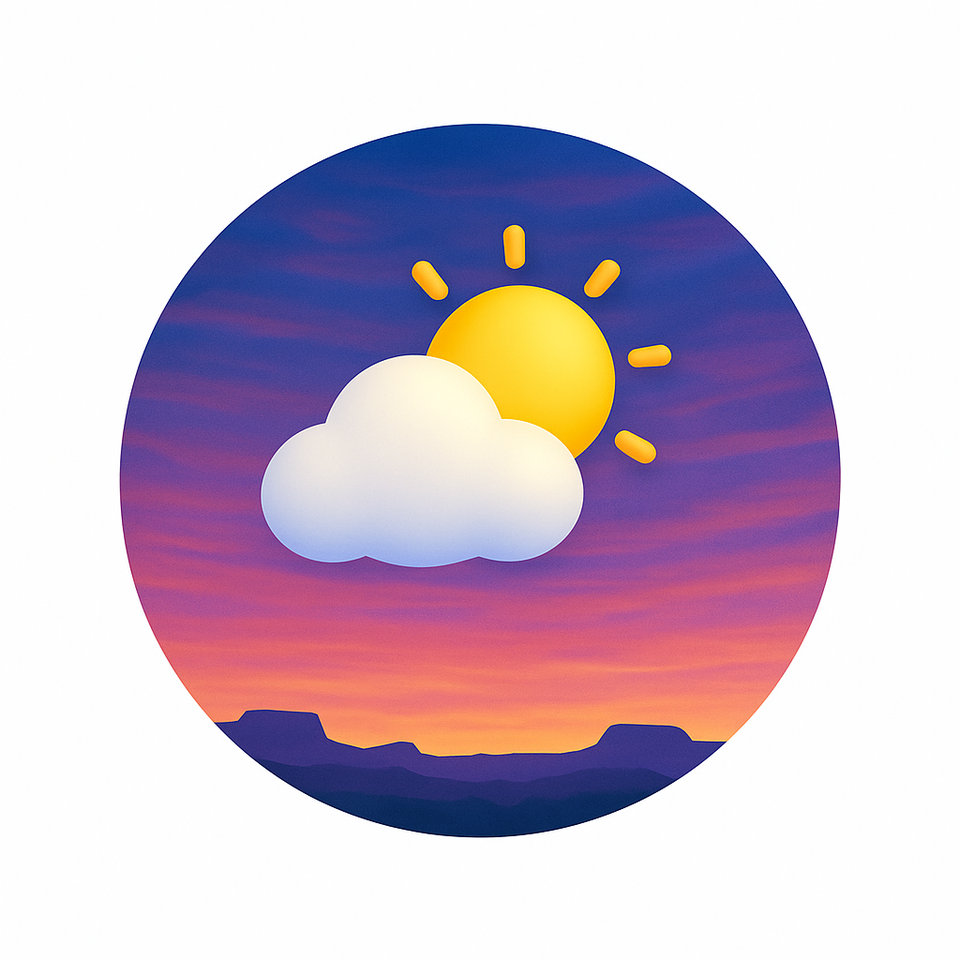

# SoDak Weather

[](https://github.com/hawkstwelve/sodak_weather/releases/latest)

A beautiful, performance-optimized weather application for South Dakota built with Flutter. This app provides current weather conditions, hourly and daily forecasts, weather radar, severe weather alerts, and Area Forecast Discussion (AFD) information from the National Weather Service.



## Features

- **Current Weather Conditions**: Real-time weather data for South Dakota cities
- **Hourly Forecast**: Detailed hourly weather predictions
- **Daily Forecast**: 10-day weather outlook
- **Weather Radar**: Interactive radar maps with animation support
- **Severe Weather Alerts**: Real-time NWS weather alerts and warnings
- **SPC Outlooks**: Storm Prediction Center severe weather outlooks
- **Area Forecast Discussion**: Detailed meteorological analysis from NWS meteorologists
- **Multiple Locations**: Support for major South Dakota cities
- **Beautiful UI**: Modern, glassmorphic interface with dynamic backgrounds based on weather conditions
- **Performance Optimized**: Designed for smooth performance on all devices

## 📱 Installation

### Download APK (Recommended for Users)

The easiest way to install SoDak Weather is to download the latest APK from our GitHub releases:

1. **Go to the [Releases page](https://github.com/hawkstwelve/sodak_weather/releases)**
2. **Download the latest APK file** (e.g., `sodak-weather-v1.0.0.apk`)
3. **Enable "Install from Unknown Sources"** on your Android device:
   - Go to Settings → Security → Unknown Sources
   - Or Settings → Apps → Special app access → Install unknown apps
4. **Install the APK** by tapping on the downloaded file
5. **Enjoy SoDak Weather!**

### System Requirements
- Android 5.0 (API level 21) or higher
- Internet connection for weather data
- Location services (optional, for future features)

### Troubleshooting Installation
- **"App not installed" error**: Make sure you've enabled "Install from Unknown Sources"
- **"Parse error"**: The APK might be corrupted, try downloading again
- **"App not compatible"**: Check that your Android version meets the requirements

### 🔄 Auto-Updates
Currently, the app doesn't support auto-updates. To get the latest version:
1. Check the [releases page](https://github.com/hawkstwelve/sodak_weather/releases) for updates
2. Download and install the new APK
3. The new version will replace the old one automatically

## APIs Used

The app integrates with multiple weather APIs:

1. **Google Weather API**
   - Provides current conditions and forecast data
   - Base URL: `https://weather.googleapis.com/v1`
   - Endpoints used:
     - `/currentConditions:lookup` - Current weather data
     - `/forecast:lookup` - 10-day forecast
     - `/hourlyForecast:lookup` - Hourly forecast

2. **National Weather Service (NWS) API**
   - Used for Area Forecast Discussion (AFD) and weather alerts
   - Base URL: `https://api.weather.gov`
   - Endpoints used:
     - `/products/types/AFD/locations/{office}` - AFD by NWS office
     - `/alerts/active` - Active weather alerts
     - `/gridpoints/{office}/{x},{y}/forecast` - Grid-based forecasts

3. **RainViewer API**
   - Provides weather radar data and imagery
   - Base URL: `https://api.rainviewer.com`
   - Endpoints used:
     - `/public/weather-maps.json` - Radar timestamps
     - `/public/weather-maps/{timestamp}/{z}/{x}/{y}/{color}/{smooth}.png` - Radar tiles

4. **Storm Prediction Center (SPC) API**
   - Provides severe weather outlooks
   - Base URL: `https://www.spc.noaa.gov`
   - Endpoints used:
     - `/products/outlook/day1otlk_cat.nolyr.geojson` - Day 1 outlook
     - `/products/outlook/day2otlk_cat.nolyr.geojson` - Day 2 outlook
     - `/products/outlook/day3otlk_cat.nolyr.geojson` - Day 3 outlook

## Project Structure

```
lib/
├── main.dart              # App entry point and configuration
├── models/                # Data models
│   ├── hourly_forecast.dart     # Hourly forecast data model
│   ├── nws_alert_model.dart     # NWS alert data model
│   ├── sd_city.dart             # South Dakota cities model
│   ├── spc_outlook.dart         # SPC outlook data model
│   └── weather_data.dart        # Weather data models
├── providers/             # State management
│   └── weather_provider.dart    # Weather data provider
├── screens/               # App screens
│   ├── afd_screen.dart          # Area Forecast Discussion screen
│   ├── radar_screen.dart        # Weather radar screen
│   ├── spc_outlooks_screen.dart # SPC outlooks screen
│   └── weather_screen.dart      # Main weather screen
├── services/              # API services
│   ├── afd_service.dart         # AFD service
│   ├── nws_alert_service.dart   # NWS alerts service
│   ├── rainviewer_api.dart      # Radar API service
│   ├── spc_outlook_service.dart # SPC outlooks service
│   └── weather_service.dart     # Weather API integration
├── theme/                 # App styling
│   └── app_theme.dart           # Global theme configuration
├── utils/                 # Helper utilities
│   ├── hour_utils.dart                   # Hour calculations
│   ├── sun_utils.dart                    # Sunrise/sunset calculations
│   └── weather_utils.dart                # Weather-related helper functions
└── widgets/               # Reusable UI components
    ├── app_drawer.dart           # Navigation drawer
    ├── forecast_card.dart        # Daily forecast card
    ├── glass_card_scroll_view.dart # Optimized scroll view
    ├── hourly_forecast_card.dart # Hourly forecast card
    ├── main_app_container.dart   # Main app container
    ├── nws_alert_banner.dart     # Weather alert banner
    ├── precipitation_chart.dart  # Precipitation chart
    ├── radar_card.dart           # Radar preview card
    └── glass/                    # Glass effect components
        ├── glass_card.dart            # Glassmorphic card component
        ├── glass_container.dart       # Glass container with blur effect
        └── frosted_background.dart    # Frosted background for screens
```

## Key Components

### Models

- `SDCity` - Represents South Dakota cities with location data and NWS office identifiers
- `WeatherData`